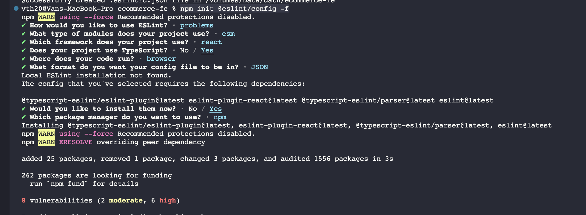
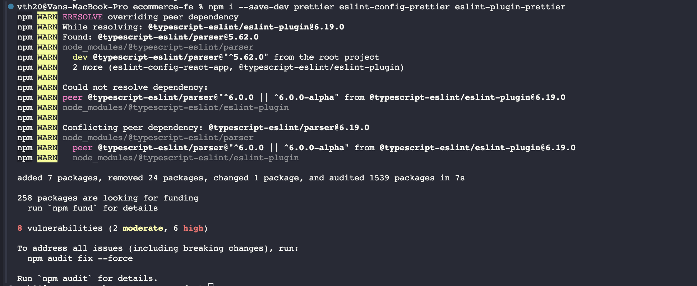

# SETUP
## Eslint
`$ npm init @eslint/config`



## Prettier
`$ npm i --save-dev prettier eslint-config-prettier eslint-plugin-prettier`



## Husky
`$ npx husky-init && npm install`
```
#!/usr/bin/env sh
. "$(dirname -- "$0")/_/husky.sh"

npm run lint
npm run lint:fix
```